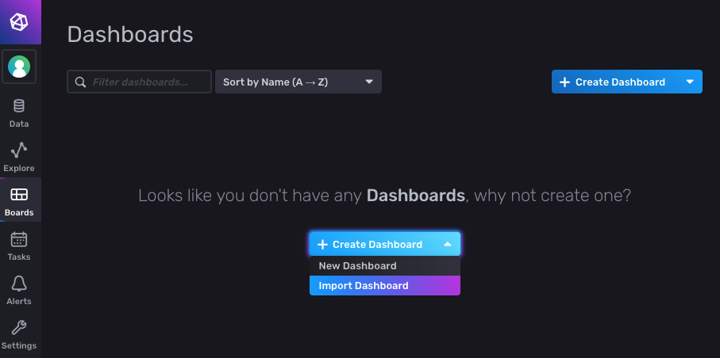

# Tedd DCS stack

TODO:  

* write intro here

Stack configuration: 

* [docker-compose.yml](docker-compose.yml) : production stack with the core services: 
  * mosquitto : mqtt broker
  * web_server : for labview data ingestion
  * influxdb : time-series database
  * telegraf : ingests data from the mqtt broker into the database
  * dashboard : Grafana monitoring dashboard
  * low_voltage : Control of the Rhode and Schwartz low-voltage power supply

**TODO: where is nodered ?** 
  

* [docker-compose.dummy.yml](docker-compose.dummy.yml) : 
additional dummy services for tests, which simulate the behaviour of 
  * a high-voltage power supply, 
  * a low-voltage power supply, 
  * and an environmental sensor. 

## Prerequisites

* Install [docker](https://docs.docker.com/get-docker/)
* Install [docker compose](https://docs.docker.com/compose/install/)

## Initial setup 

Start the InfluxDB service: 

```
docker-compose up -d influxdb
```

This will create a configuration file for influxdb, `influxdb/config/influx-configs`, 
with this content: 

```shell
[default]
  url = "http://localhost:8086"
  token = "nGTtMTEsXZlSnz0KOAxbj22f-bAZbAcmOnTSX1q04CjYoZbHKg2Vf-fzb3IxrSgYYuf442ZrDgS8l9WcOOHMSA=="
  org = "cms-tedd"
  active = true
```

Set this environment variable with your token: 

```shell
export TRACKER_DCS_INFLUXDB_TOKEN=<the_token>
```


## Start the stack together with the dummy services 

```
docker compose -f docker-compose.yml -f docker-compose.dummy.yml up -d 
```

To check the running services:

```
docker compose -f docker-compose.yml -f docker-compose.dummy.yml ps 
```

```
NAME                  COMMAND                  SERVICE             STATUS              PORTS
stack-dashboard-1     "/run.sh"                dashboard           running             0.0.0.0:3001->3000/tcp
stack-hv-1            "python dummy/hv.py …"   hv                  running             
stack-influxdb-1      "/entrypoint.sh infl…"   influxdb            running             0.0.0.0:8087->8086/tcp
stack-low_voltage-1   "python3 hmp.py lw_v…"   low_voltage         exited (1)          
stack-lv-1            "python dummy/hv.py …"   lv                  running             
stack-mosquitto-1     "/docker-entrypoint.…"   mosquitto           running             0.0.0.0:1884->1883/tcp
stack-sensor_1-1      "python dummy/sensor…"   sensor_1            running             
stack-telegraf-1      "/entrypoint.sh tele…"   telegraf            running             8125/udp
stack-web_server-1    "uvicorn tracker_dcs…"   web_server          running             0.0.0.0:8001->8000/tcp
```

In the case above, I'm running the stack on my mac, which has no access to 
the low voltage power supply. As a consequence, the low voltage container 
exits with an error. This is perfectly fine. 

On the DAQ PC however, the container must be running.

## Using the services 

### Mosquitto

[Mosquitto](https://mosquitto.org/) is the message broker. 
Services such as the stack modules can publish messages to topics managed by 
the broker. They can also subscribe to topics.

All messages are exchanged with the MQTT protocol, which is similar to TCP 
but more lightweight. 

**The MQTT broker is the backbone of all communications within the stack**

As we saw above, the broker container is running: 

```shell
stack-mosquitto-1     "/docker-entrypoint.…"   mosquitto           running             0.0.0.0:1884->1883/tcp
```

The mosquitto port in the container, 1883, is mapped to port 1884 on the host
machine. 

The mosquitto container runs the mosquitto server, and features a command line
mosquitto client, `mosquitto_sub`

We'll run this client from within the container to connect to all topics: 

```
docker exec stack-mosquitto-1 mosquitto_sub -v -t /#
```

You should see the messages that are being sent by the dummy modules: 

```
/lv/status [{"number": 0, "on": 0, "vreq": 0.0}]
/hv/status [{"number": 0, "on": 0, "vreq": 0.0}]
/sensor_1/status {"meas1": -0.9931889975255942, "meas2": 0.9931889975255942}
```

You can also submit messages with `mosquitto_pub`. For help, do: 

```shell
docker exec stack-mosquitto-1 mosquitto_pub --help 
```

### InfluxDB

InfluxDB is the time-series database.

* data from the MQTT broker is written to InfluxDB with Telegraf.
The file [telegraf.conf](telegraf.conf) describes which data to write and how.
**To add more measurements, you need to edit this file.** 
* data can be visualized in different ways: 
  * with python (TODO: write a short documentation for this)
  * with Grafana
  * with the InfluxDB dashboard itself as we will see below

Make sure InfluxDB is running with `docker ps` : 

```shell
6dc67d8562e2   influxdb:2.0  "/entrypoint.sh infl…"   40 hours ago   Up 40 hours   0.0.0.0:8087->8086/tcp  stack-influxdb-1
```

We see that influxdb exposes port 8087. 

Connect to the InfluxDB dashboard by pointing your browser to 
[http://localhost:8087](http://localhost:8087).

The username and password are set in [docker-compose.yml](docker-compose.yml) to
 `dbuser` and `password` respectively. 

**TODO: This needs to change! use env vars**. 

Create your first dashboard by importing a dashboard we have prepared for you,
as shown below: 



The file to import is [influxdb/dashboards/dummy.json](influxdb/dashboards/dummy.json)

### Grafana

Go to [http://localhost:3001](http://localhost:3001)

* username : admin
* password : admin 

Skip the creation of a new password

**TODO** : 

* add dashboard ! 
* how to connect to influxdb measurements ? 
* need to have the dashboard set up without any intervention from the user (influxdb connection and dashboard)

### InfluxDB

**TODO why is the port exposed? what is the user supposed to do with it ?**

### Nodered 

**TODO : where is nodered ?**

