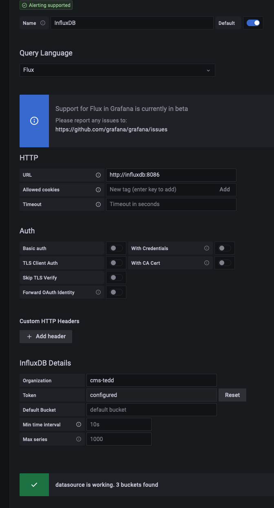
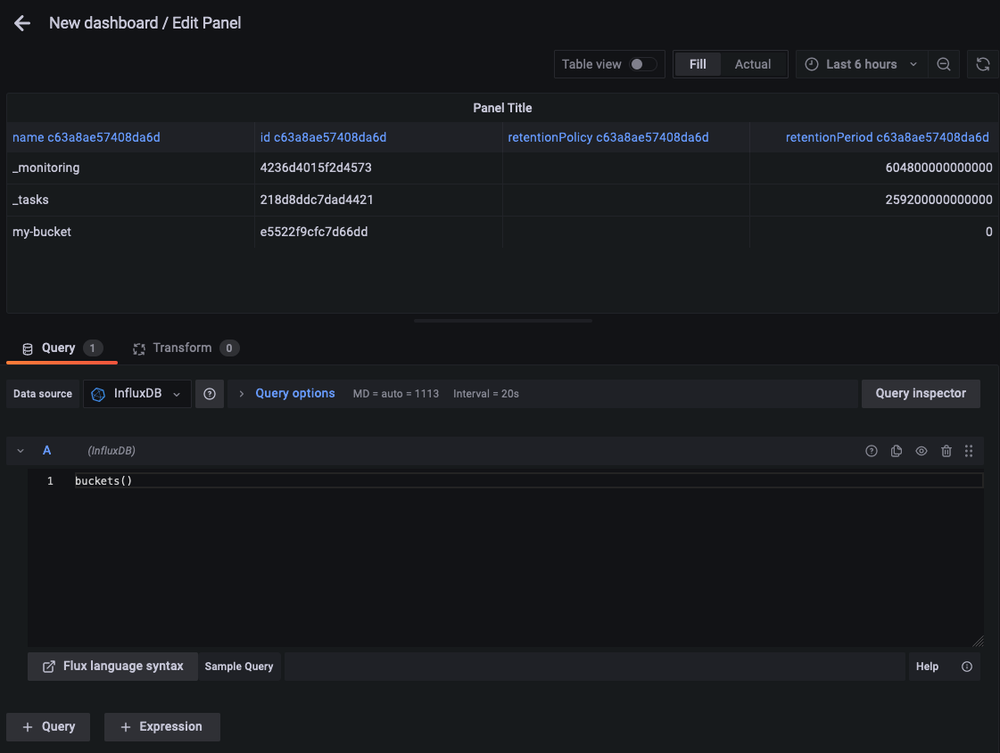
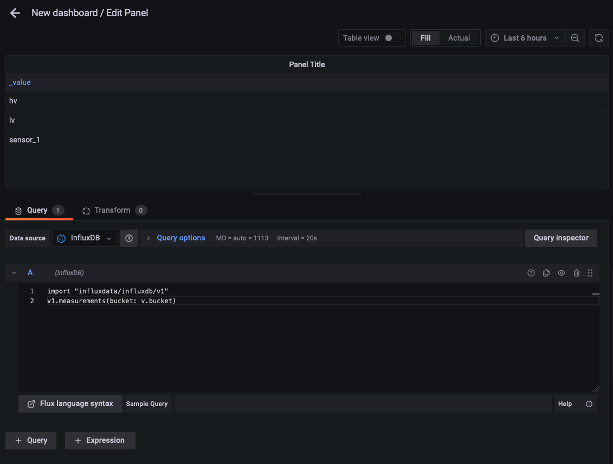
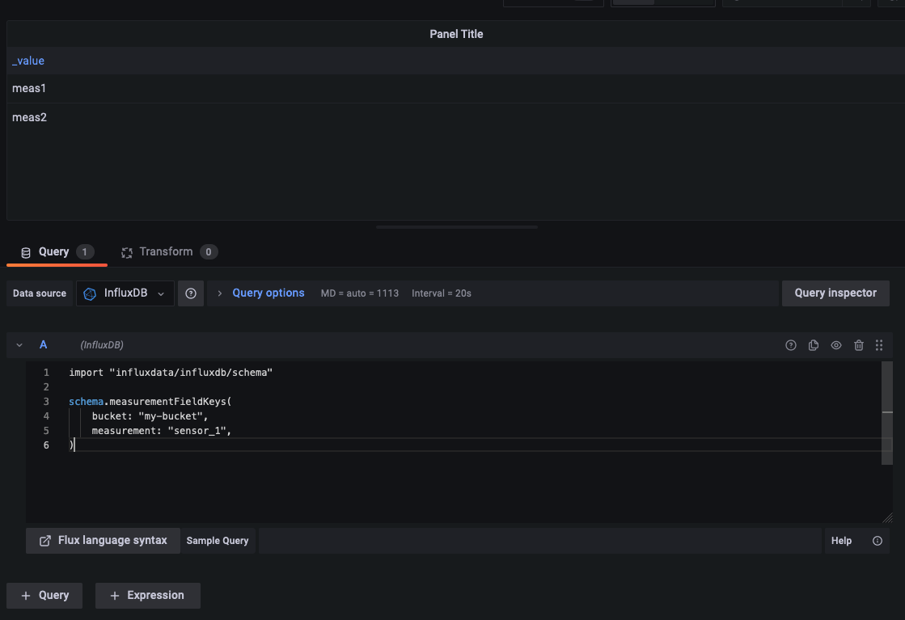
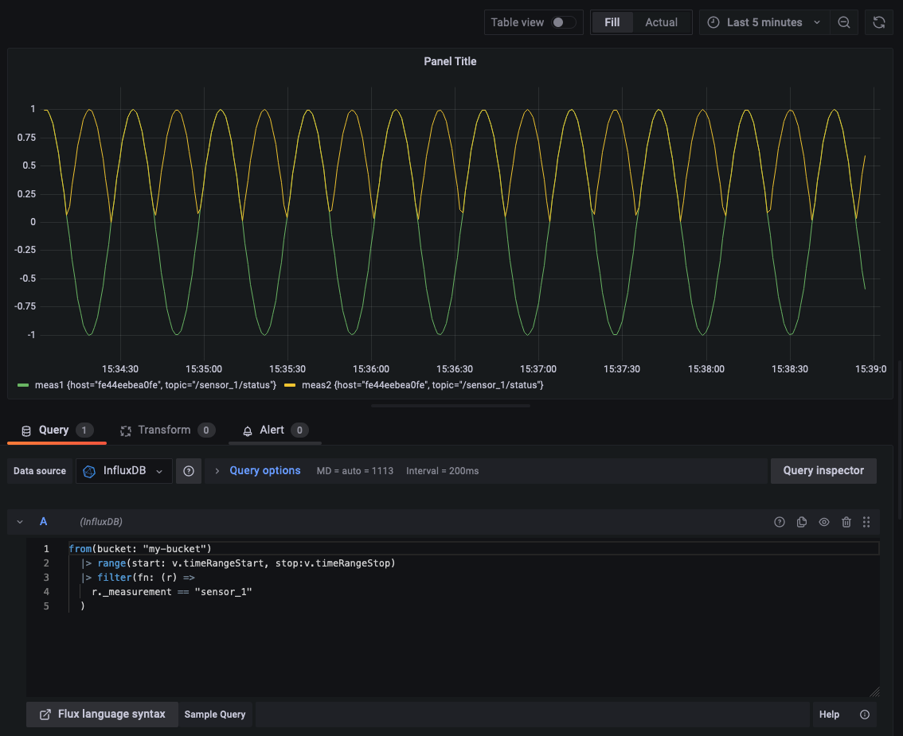

# Grafana

Grafana is used as a flexible dashboard system that can be used to display 
the InfluxDB data.

To access the dashboard, go to [http://localhost:3001](http://localhost:3001)

By default, the credentials are:

* username : admin
* password : admin 

If the credentials don't work, ask Colin or Candan what they are. 

## Prerequisites

Before trying to set up the dashboard, we must be sure that data is being written
to InfluxDB by Telegraf

Check the telegraf logs:

```shell
docker compose logs -f telegraf
```

You should see: 

```shell
stack-telegraf-1  | 2023-01-23T14:14:18Z I! Using config file: /etc/telegraf/telegraf.conf
stack-telegraf-1  | 2023-01-23T14:14:18Z I! Starting Telegraf 1.25.0
stack-telegraf-1  | 2023-01-23T14:14:18Z I! Available plugins: 228 inputs, 9 aggregators, 26 processors, 21 parsers, 57 outputs, 2 secret-stores
stack-telegraf-1  | 2023-01-23T14:14:18Z I! Loaded inputs: mqtt_consumer (6x)
stack-telegraf-1  | 2023-01-23T14:14:18Z I! Loaded aggregators: 
stack-telegraf-1  | 2023-01-23T14:14:18Z I! Loaded processors: 
stack-telegraf-1  | 2023-01-23T14:14:18Z I! Loaded secretstores: 
stack-telegraf-1  | 2023-01-23T14:14:18Z I! Loaded outputs: influxdb_v2
stack-telegraf-1  | 2023-01-23T14:14:18Z I! Tags enabled: host=fe44eebea0fe
stack-telegraf-1  | 2023-01-23T14:14:18Z I! [agent] Config: Interval:10s, Quiet:false, Hostname:"fe44eebea0fe", Flush Interval:10s
stack-telegraf-1  | 2023-01-23T14:14:18Z D! [agent] Initializing plugins
stack-telegraf-1  | 2023-01-23T14:14:18Z D! [agent] Connecting outputs
stack-telegraf-1  | 2023-01-23T14:14:18Z D! [agent] Attempting connection to [outputs.influxdb_v2]
stack-telegraf-1  | 2023-01-23T14:14:18Z D! [agent] Successfully connected to outputs.influxdb_v2
stack-telegraf-1  | 2023-01-23T14:14:18Z D! [agent] Starting service inputs
stack-telegraf-1  | 2023-01-23T14:14:18Z I! [inputs.mqtt_consumer] Connected [tcp://mosquitto:1883]
stack-telegraf-1  | 2023-01-23T14:14:18Z I! [inputs.mqtt_consumer] Connected [tcp://mosquitto:1883]
stack-telegraf-1  | 2023-01-23T14:14:18Z I! [inputs.mqtt_consumer] Connected [tcp://mosquitto:1883]
stack-telegraf-1  | 2023-01-23T14:14:18Z I! [inputs.mqtt_consumer] Connected [tcp://mosquitto:1883]
stack-telegraf-1  | 2023-01-23T14:14:18Z I! [inputs.mqtt_consumer] Connected [tcp://mosquitto:1883]
stack-telegraf-1  | 2023-01-23T14:14:18Z I! [inputs.mqtt_consumer] Connected [tcp://mosquitto:1883]
stack-telegraf-1  | 2023-01-23T14:14:28Z D! [outputs.influxdb_v2] Wrote batch of 30 metrics in 6.859893ms
stack-telegraf-1  | 2023-01-23T14:14:28Z D! [outputs.influxdb_v2] Buffer fullness: 0 / 10000 metrics
```

If you don't see something like this: `Wrote batch of 30 metrics in 6.859893ms`, 
something is going wrong. For example, it could be that the InfluxDB token in the file 
[my.env](my.env) has not been set properly. 

This must be solved before proceeding further 

## InfluxDB data source

Add InfluxDB as a data source: 



Note that: 

* We use InfluxDB 2 so we need to use Flux as a query language
* The URL of the InfluxDB server is `http://influxdb:8086`. Indeed: 
  * Grafana is running in the docker stack. From there, the url of the InfluxDB 
container is simply `influxdb`. The port exposed by this container within the stack
is `8086`. See [docker-compose.yml](docker-compose.yml) for more information
* All Auths are uncheched
* The organization and tokens can be found in your [influxdb/config/influx-configs](influxdb/config/influx-configs)

Save and test your data source and go back to the home menu. 

## Dashboard creation 

Create a new dashboard, and a new panel in this dashboard.

Use the `Show bucket` sample query and the table view to display the list of 
buckets in your InfluxDB database: 



The `_monitoring` and `_tasks` bucket are internal InfluxDB buckets. 
Our bucket is `my-bucket`. The name is set in [telegraf.conf](telegraf/telegraf.conf).

---
Before going further: 

**Edit your data source and set my-bucket as a default bucket**.

(you can find your data source in the global settings). 
Then go back to the exploration window.

---

You can then get the list of measurements within the bucket: 



And you can run this query to see the list of fields in the `hv`
measurement

```flow js
import "influxdata/influxdb/schema"

schema.measurementFieldKeys(
    bucket: "my-bucket",
    measurement: "sensor_1",
)
```

This should give you two fields, `meas1` and `meas2`



This is expected from the [telegraf configuration](telegraf/telegraf.conf) 
and from the mqtt logs: 

```shell
docker exec stack-mosquitto-1 mosquitto_sub -v -t /#
```

```shell
...
/sensor_1/status {"meas1": 0.5439515571875321, "meas2": 0.5439515571875321}
...
```

Let us now set up our panel to display both `meas1` and `meas2`
in the same plot. For this, use the Simple query template with this query: 

```shell
from(bucket: "my-bucket")
  |> range(start: v.timeRangeStart, stop:v.timeRangeStop)
  |> filter(fn: (r) => r._measurement == "sensor_1")
  |> filter(fn: (r) => r._field =~ /meas.*/)
  |> aggregateWindow(every: v.windowPeriod, fn: mean, createEmpty: false)
  |> yield(name: "mean")
```

Note the use of: 

* aggregateWindow: without this, the query will fail if we try and display
too many points over a long time range
* the regex filter: without it, aggregateWindow fails. 



We could filter on the field name to get only `meas1` or only `meas2`.

Now save your dashboard. 

## Exporting and importing dashboards

Dashboards can be exported as json, and imported back later on, 
even on a different machine. 

To do this, click the share button, and export as JSON 
(keep Export for sharing externally unchecked). 

To import a dashboard, use the Dashboards menu. 

You may commit your dashboards in [../grafana/dashboards](../grafana/dashboards).

